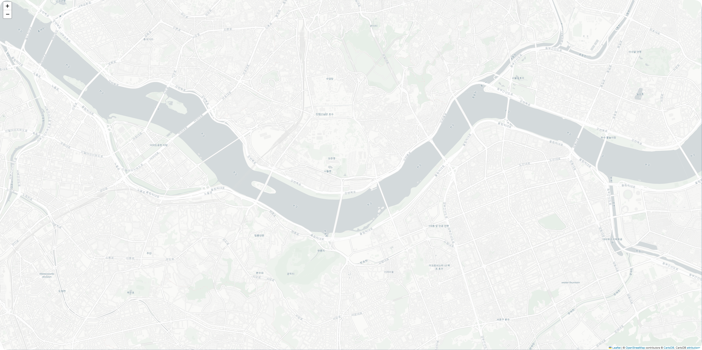
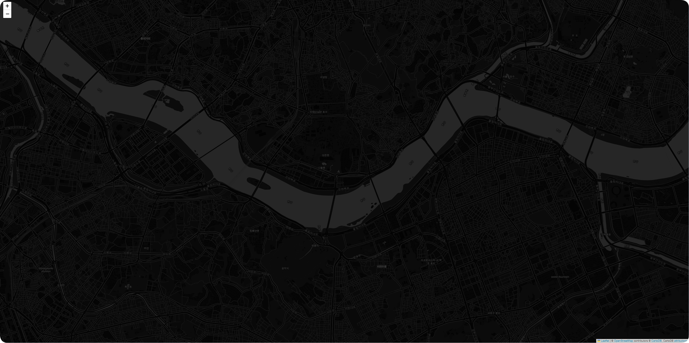

## Folium이란?
[Folium](https://python-graph-gallery.com/288-map-background-with-folium/)은 leaflet.js를 기반으로 만들어진 Python의 라이브러리로, 위도/경도 좌표로 지도 위에 마커나 라인을 활용하여 데이터 시각화가 가능하다.

### 1.Folium 라이브러리 설치
터미널에 아래의 명령어를 입력하여 folium 라이브러리를 설치한다.
```python
 $ pip install folium
```
### 2. Folium 사용법(syntax)
#### 2.1 지도 띄우기
folium.Map()을 이용하여 지도의 초기상태를 설정한다.
* location: 띄우고자하는 지도의 중심 좌표 
* zoom_start: 지도의 초기 화면 확대/축소 수준 (기본값 10, 최대값 18)

```python
m = folum.Map(location=[위도,경도], zoom_start=숫자) 
```

#### 2.2 지도 스타일 지정
tiles = '스타일' 속성을 활용하여 지도의 스타일을 지정할 수 있으며, 기본값은 'OpenStreetMap'이다.

[ OpenStreetMap ]
```python
m = folum.Map(location=[37.520883,126.985974], zoom_start=14, tiles='OpenStreetMap') 
```


[ CartoDB positron ]
```python
m = folum.Map(location=[37.520883,126.985974], zoom_start=14, tiles='CartoDB positron') 
```



[ CartoDB dark_matter ]
```python
m = folum.Map(location=[37.520883,126.985974], zoom_start=14, tiles='CartoDB dark_matter') 
```



#### 2.3 지도상에 마커 추가
folium.Marker().add_to()를 이용하여 생성한 지도에 마커를 추가할 수 있다.
* location: 마커를 추가할 위도/경도 좌표
* popup: 마우스 클릭시 표기되는 문구 지정
* tooltip: 마우스 오버시 표기되는 문구 지정

```python
folium.Marker(location=[위도, 경도], popup='팝업메세지', tooltip='메세지', icon=folium.Icon(color='',icon='')).add_to(m)
```
